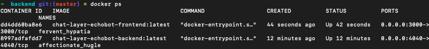

# Welcome to EchoBot FullStack Application
Real-time echobot response back to client.The EchoBot is a tiny chatbot that repeats anything you say to it.

### Technologies Used

   

[Demo](https://chatlayer-code-tests.vercel.app/)
## Important!
**Before starting to react be sure the backend is working. If you click the demo link wait for 10 seconds backend Heroku server will awake soon then you can chat with the bot.**

### Getting Started
1. Clone this repo
2. `npm install` on both `frontend` and `backend` folders
3. `npm start`

### Run with Docker
1. Each backend and frontend folder has a Dockerfile and `build.sh` you can simply run `build.sh`.
2. When you write `docker ps` command you will see like below images both frontend and backend works fine.

