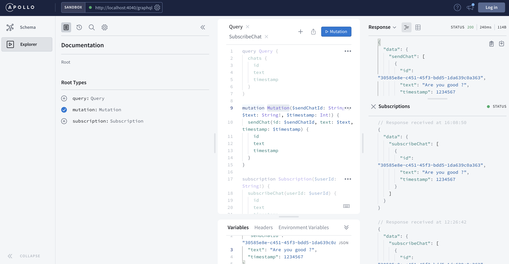

# EchoBot GraphQL Backend

This example demonstrates a basic echobot message back as the response.Using GraphQL subscriptions are a way to push data from the server to the clients that choose to listen to real time messages from the server. 

You can test mutation and subscription via apollo studio.



```graphql

mutation Mutation($sendChatId: String!, $text: String!, $timestamp: Int!) {
  sendChat(id: $sendChatId, text: $text, timestamp: $timestamp) {
    id
    text
    timestamp
  }
}

subscription SubscribeChat($userId: String!) {
  subscribeChat(userId: $userId) {
    id
    text
    timestamp
  }
}

```
### Mutation and Subscription Variables

```json

{
  "sendChatId": "30585e8e-c451-45f3-bdd5-1da639c0a363",
  "text": "hello",
  "timestamp": 1640480614605
}

{
  "userId": "30585e8e-c451-45f3-bdd5-1da639c0a363"
}


```
## Run locally

```shell
npm install
npm run start
```

## .env file

```shell
PORT=4040
```
## Developed Npm and Node Version
```
node -v
v16.13.1

npm -v
8.1.2
```

