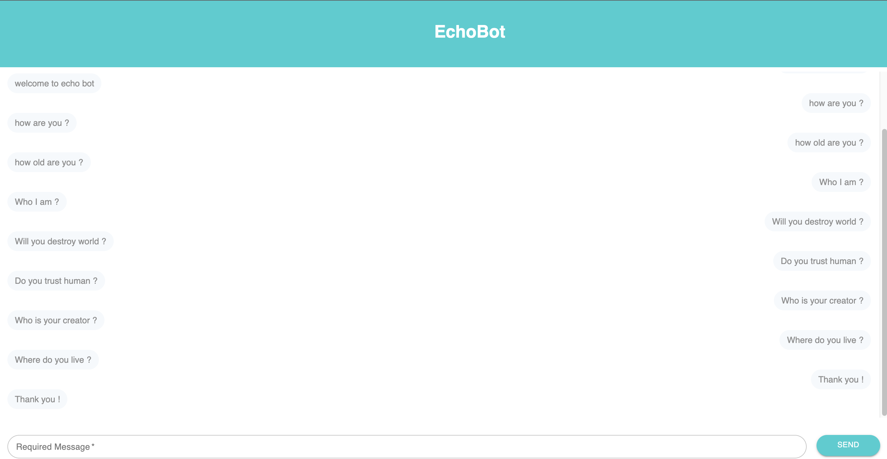

# EchoBot GraphQL Frontend

Build a chat widget that will allow the user to send a message to the EchoBot's backend.



[Demo](chatlayer-code-tests.vercel.app)
## Important!
**Before starting to react be sure the backend is working. If you click the demo link wait for 10 seconds backend Heroku server will awake soon then you can chat with the bot.**


## Run locally

```shell
npm install
npm start
```
## Test locally via Cypress
Before starting the test be sure frontend works fine.
```shell
npm test
```
## .env file

```shell
REACT_APP_HTTP_LINK=http://localhost:4040/api/graphql
REACT_APP_WEB_SOCKET_LINK=ws://localhost:4040/api/graphql
```
## Developed Npm and Node Version
```
node -v
v16.13.1

npm -v
8.1.2
```

